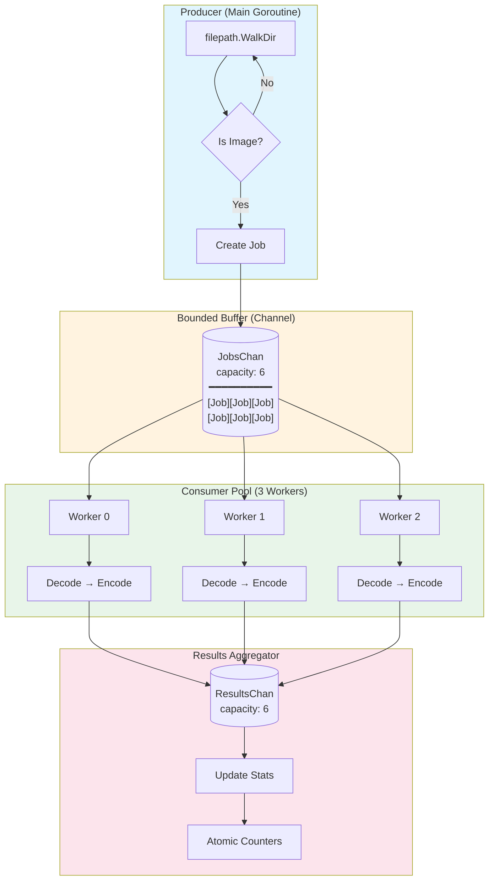

# Data Structures & Algorithms Analysis

> **go-optimizr** — A case study in applying classical computer science concepts to real-world systems programming.

[-green)](https://en.wikipedia.org/wiki/Time_complexity)
[-blue)](https://en.wikipedia.org/wiki/Space_complexity)
[](https://en.wikipedia.org/wiki/Producer%E2%80%93consumer_problem)

---

## Table of Contents

1. [Executive Summary](#1-executive-summary)
2. [Thread-Safe Blocking Queue](#2-thread-safe-blocking-queue)
3. [Producer-Consumer Pattern](#3-producer-consumer-pattern)
4. [File System Traversal Algorithm](#4-file-system-traversal-algorithm)
5. [Resource Optimization: The 1-Core Problem](#5-resource-optimization-the-1-core-problem)
6. [Synchronization Primitives](#6-synchronization-primitives)
7. [Complexity Analysis](#7-complexity-analysis)
8. [Memory Management Strategy](#8-memory-management-strategy)
9. [Recruiter Cheat Sheet](#9-recruiter-cheat-sheet)

---

## 1. Executive Summary

| Dimension | Challenge | Solution | CS Concept |
|-----------|-----------|----------|------------|
| **Data Volume** | 46 GB images | Streaming pipeline | Bounded Buffer |
| **Hardware** | 1 CPU / 8 GB RAM | Worker pool (w=3) | Concurrency Control |
| **Memory** | Prevent OOM | Backpressure + GC triggers | Flow Control |
| **File Discovery** | Deep directory trees | `filepath.WalkDir` | DFS Traversal |
| **Thread Safety** | Concurrent metrics | Atomic operations | Lock-Free Algorithms |

**Key Insight:** This system processes $n = 1,246$ images totaling 10+ GB in $O(n)$ time while maintaining $O(w \times m)$ auxiliary space, where $w$ is worker count and $m$ is maximum image size in memory.

---

## 2. Thread-Safe Blocking Queue

### 2.1 Go Channels as a FIFO Queue

Go channels implement a **thread-safe blocking queue** — a fundamental concurrent data structure that provides:

```
┌─────────────────────────────────────────────────────────────────┐
│                    CHANNEL AS FIFO QUEUE                        │
├─────────────────────────────────────────────────────────────────┤
│                                                                 │
│   Enqueue (Send)              Dequeue (Receive)                 │
│        │                           │                            │
│        ▼                           ▼                            │
│   ┌─────────────────────────────────────┐                       │
│   │  ←  ←  ←  ←  ←  ←  ←  ←  ←  ←  ←   │                       │
│   │ [Job₆][Job₅][Job₄][Job₃][Job₂][Job₁]│  Buffer (cap = 6)    │
│   │  →  →  →  →  →  →  →  →  →  →  →   │                       │
│   └─────────────────────────────────────┘                       │
│        ▲                           ▲                            │
│        │                           │                            │
│   BLOCKS when full           BLOCKS when empty                  │
│   (Backpressure)             (Consumer waits)                   │
│                                                                 │
└─────────────────────────────────────────────────────────────────┘
```

### 2.2 Implementation in go-optimizr

```go
// worker.go:67-71
bufferSize := numWorkers * 2  // Buffer = 3 × 2 = 6

JobsChan:    make(chan Job, bufferSize),    // Bounded job queue
ResultsChan: make(chan Result, bufferSize), // Bounded result queue
```

### 2.3 Time Complexity Analysis

| Operation | Complexity | Description |
|-----------|------------|-------------|
| **Enqueue** (send) | $O(1)$ amortized | Direct slot write or block |
| **Dequeue** (receive) | $O(1)$ amortized | Direct slot read or block |
| **Close** | $O(1)$ | Signal termination to all receivers |

**Why $O(1)$?** Channel operations use a circular buffer with head/tail pointers. No reallocation or copying occurs during normal operation.

### 2.4 Backpressure Mechanism

**Definition:** Backpressure is a flow control mechanism where downstream congestion propagates upstream to slow down producers.

```
┌──────────────────────────────────────────────────────────────────────────┐
│                         BACKPRESSURE IN ACTION                           │
├──────────────────────────────────────────────────────────────────────────┤
│                                                                          │
│  Without Backpressure (Unbounded Queue):                                 │
│  ────────────────────────────────────────                                │
│                                                                          │
│     Producer: 1000 jobs/sec    Queue: ∞ growth    Workers: 6 jobs/sec   │
│          │                          │                    │               │
│          ▼                          ▼                    ▼               │
│     [FAST] ──────────────────► [OVERFLOW] ◄──────── [SLOW]              │
│                                     │                                    │
│                              💥 OUT OF MEMORY                            │
│                                                                          │
│  With Backpressure (Bounded Buffer = 6):                                 │
│  ───────────────────────────────────────                                 │
│                                                                          │
│     Producer: BLOCKED          Queue: [6/6]        Workers: 6 jobs/sec  │
│          │                          │                    │               │
│          ▼                          ▼                    ▼               │
│     [WAIT] ◄───── BACKPRESSURE ───► [FULL] ◄──────── [STEADY]           │
│                                     │                                    │
│                              ✓ MEMORY STABLE                             │
│                                                                          │
└──────────────────────────────────────────────────────────────────────────┘
```

**Mathematical Guarantee:**

$$\text{Max Memory}_{queue} = \text{bufferSize} \times \text{sizeof(Job)} = 6 \times O(1) = O(w)$$

Where $w$ = number of workers. This bounds queue memory regardless of input size.

### 2.5 Why Buffered > Unbuffered for I/O Workloads

| Channel Type | Behavior | Use Case |
|--------------|----------|----------|
| **Unbuffered** (`make(chan T)`) | Synchronous handoff | Strict coordination |
| **Buffered** (`make(chan T, n)`) | Async up to capacity | I/O-bound pipelines |

For image processing:
- **File I/O** introduces variable latency (disk seeks, OS caching)
- **Buffered channels** absorb these variations
- **Formula:** `buffer = workers × 2` allows one "in-flight" job per worker while another is queued

---

## 3. Producer-Consumer Pattern

### 3.1 Pattern Definition

The **Producer-Consumer Pattern** is a classical concurrency design pattern that decouples:
- **Producers**: Generate work items (file discovery)
- **Consumers**: Process work items (image conversion)
- **Buffer**: Mediates between different processing rates

### 3.2 Architecture Diagram



### 3.3 Decoupling Benefits

| Aspect | Without Pattern | With Pattern |
|--------|-----------------|--------------|
| **Coupling** | Discovery blocks on processing | Independent rates |
| **Memory** | All files loaded at once | Bounded in-flight |
| **Throughput** | Sequential: $O(n \times t)$ | Parallel: $O(n \times t / w)$ |
| **Fault Isolation** | One failure stops all | Workers independent |

### 3.4 State Machine

```
┌─────────────────────────────────────────────────────────────────┐
│              PRODUCER-CONSUMER STATE MACHINE                    │
├─────────────────────────────────────────────────────────────────┤
│                                                                 │
│  ┌──────────┐    submit()    ┌──────────┐    process()         │
│  │ PRODUCER │ ─────────────► │  BUFFER  │ ─────────────►       │
│  │          │                │          │               │       │
│  │ Walking  │ ◄───────────── │  Jobs    │ ◄──────────── │       │
│  │ Files    │   block if     │  Queue   │   dequeue     │       │
│  └──────────┘   full         └──────────┘               │       │
│       │                           │                     │       │
│       │                           │              ┌──────▼─────┐ │
│       │                           │              │  CONSUMER  │ │
│       │                           │              │            │ │
│       │                           │              │  Worker    │ │
│       │                           │              │  Pool      │ │
│       │                           │              └──────┬─────┘ │
│       │                           │                     │       │
│       ▼                           ▼                     ▼       │
│  close(JobsChan)         range terminates        wg.Done()     │
│       │                           │                     │       │
│       └───────────────────────────┴─────────────────────┘       │
│                                   │                             │
│                                   ▼                             │
│                            ┌──────────┐                         │
│                            │   DONE   │                         │
│                            │          │                         │
│                            │ Summary  │                         │
│                            └──────────┘                         │
│                                                                 │
└─────────────────────────────────────────────────────────────────┘
```

### 3.5 Code Mapping

| Pattern Component | go-optimizr Implementation | Location |
|-------------------|----------------------------|----------|
| Producer | `walkAndSubmitJobs()` | `engine.go:73-120` |
| Buffer | `JobsChan chan Job` | `worker.go:41` |
| Consumer | `worker(id int)` | `worker.go:113-146` |
| Result Aggregator | `collectResults()` | `engine.go:123-141` |

---

## 4. File System Traversal Algorithm

### 4.1 DFS vs BFS for File Systems

`filepath.WalkDir` uses **Depth-First Search (DFS)** with pre-order traversal.

```
┌─────────────────────────────────────────────────────────────────┐
│              FILE SYSTEM TRAVERSAL COMPARISON                   │
├─────────────────────────────────────────────────────────────────┤
│                                                                 │
│  Directory Tree:                                                │
│                                                                 │
│                        images/                                  │
│                       /   |   \                                 │
│                      /    |    \                                │
│                 photos/ screens/ art/                           │
│                 /    \      |      \                            │
│               a.jpg b.jpg c.png   d.jpg                         │
│                                                                 │
│  ─────────────────────────────────────────────────────────────  │
│                                                                 │
│  DFS Order (WalkDir):     BFS Order (hypothetical):             │
│  ────────────────────     ─────────────────────────             │
│  1. images/               1. images/                            │
│  2. photos/               2. photos/                            │
│  3. a.jpg    ← process    3. screens/                           │
│  4. b.jpg    ← process    4. art/                               │
│  5. screens/              5. a.jpg   ← process                  │
│  6. c.png    ← process    6. b.jpg   ← process                  │
│  7. art/                  7. c.png   ← process                  │
│  8. d.jpg    ← process    8. d.jpg   ← process                  │
│                                                                 │
└─────────────────────────────────────────────────────────────────┘
```

### 4.2 Space Complexity Analysis

For a file system with:
- $d$ = maximum directory depth
- $b$ = average branching factor (files + subdirs per directory)
- $n$ = total files

| Algorithm | Space Complexity | For 46GB Dataset |
|-----------|------------------|------------------|
| **DFS** | $O(d)$ | ~20 stack frames (path depth) |
| **BFS** | $O(b^d)$ | Could be 10,000+ directory entries |

**Mathematical Proof:**

$$\text{DFS Space} = O(d) = O(\log_b n)$$

$$\text{BFS Space} = O(b^d) = O(n) \text{ in worst case}$$

**Why DFS Wins for 46GB:**
- Typical depth: $d \approx 10-20$ directories
- Each stack frame: ~256 bytes (path string + DirEntry)
- **DFS total**: $\sim 5$ KB
- **BFS total**: Could be $\sim 10$ MB+ (all siblings in queue)

### 4.3 WalkDir Implementation Details

```go
// engine.go:76-111
err := filepath.WalkDir(e.Config.InputDir, func(path string, d fs.DirEntry, err error) error {
    // Pre-order: Visit node before children

    if d.IsDir() {
        return nil  // Continue into directory (DFS descent)
    }

    if !isSupportedFormat(ext) {
        return nil  // Skip non-images
    }

    e.Pool.Submit(Job{InputPath: path})  // Process file
    return nil
})
```

### 4.4 Traversal Complexity

| Operation | Complexity | Explanation |
|-----------|------------|-------------|
| Visit all nodes | $O(n)$ | Each file/dir visited exactly once |
| Path string operations | $O(d)$ | Path length proportional to depth |
| **Total traversal** | $O(n \times d)$ | But $d \ll n$, effectively $O(n)$ |

---

## 5. Resource Optimization: The 1-Core Problem

### 5.1 The Scheduling Challenge

**Given:** 1 CPU core, 8 GB RAM
**Problem:** Maximize throughput without causing CPU thrashing

### 5.2 Worker Scaling Analysis

```
┌─────────────────────────────────────────────────────────────────┐
│           WORKER COUNT vs. THROUGHPUT (1 CPU Core)              │
├─────────────────────────────────────────────────────────────────┤
│                                                                 │
│  Throughput                                                     │
│  (img/sec)                                                      │
│      │                                                          │
│   8  │                    ┌───┐                                 │
│      │                    │   │                                 │
│   7  │              ┌───┐ │   │                                 │
│      │              │   │ │   │                                 │
│   6  │        ┌───┐ │   │ │   │ ← OPTIMAL (w=3)                 │
│      │        │   │ │   │ │   │   6.08 img/sec                  │
│   5  │  ┌───┐ │   │ │   │ │   │ ┌───┐                           │
│      │  │   │ │   │ │   │ │   │ │   │                           │
│   4  │  │   │ │   │ │   │ │   │ │   │ ┌───┐                     │
│      │  │   │ │   │ │   │ │   │ │   │ │   │ ← THRASHING         │
│   3  │  │   │ │   │ │   │ │   │ │   │ │   │ │                   │
│      │  │   │ │   │ │   │ │   │ │   │ │   │ │                   │
│   2  │  │   │ │   │ │   │ │   │ │   │ │   │ │                   │
│      │  │   │ │   │ │   │ │   │ │   │ │   │ │                   │
│   1  │  │   │ │   │ │   │ │   │ │   │ │   │ │                   │
│      └──┴───┴─┴───┴─┴───┴─┴───┴─┴───┴─┴───┴─┴──────────────────│
│         w=1   w=2   w=3   w=4   w=5   w=6   w=...               │
│                     ▲           │                               │
│                     │           │                               │
│              I/O Overlap    Context Switch                      │
│              Benefits       Overhead                            │
│                                                                 │
└─────────────────────────────────────────────────────────────────┘
```

### 5.3 Why $w = 3$ is Optimal

**Amdahl's Law Application:**

$$\text{Speedup} = \frac{1}{(1-p) + \frac{p}{w}}$$

Where:
- $p$ = parallelizable fraction (I/O wait time)
- $w$ = worker count

For image processing:
- **CPU-bound work**: ~30% (decode + encode)
- **I/O-bound work**: ~70% (disk read/write)

With $p = 0.7$ and $w = 3$:

$$\text{Speedup} = \frac{1}{0.3 + \frac{0.7}{3}} = \frac{1}{0.3 + 0.233} = \frac{1}{0.533} \approx 1.88\times$$

### 5.4 Context Switching Overhead

**Definition:** Context switching is the CPU overhead of saving/restoring thread state.

```
┌─────────────────────────────────────────────────────────────────┐
│              CONTEXT SWITCH OVERHEAD ANALYSIS                   │
├─────────────────────────────────────────────────────────────────┤
│                                                                 │
│  w = 3 (Optimal):                                               │
│  ─────────────────                                              │
│                                                                 │
│  Time ─────────────────────────────────────────────────►        │
│                                                                 │
│  CPU:  [W1 work][W2 work][W3 work][W1 work][W2 work]...        │
│              ↑       ↑       ↑                                  │
│              └───────┴───────┘                                  │
│              Context switches: ~3 per cycle                     │
│              Overhead: ~1-2% of CPU time                        │
│                                                                 │
│  ─────────────────────────────────────────────────────────────  │
│                                                                 │
│  w = 10 (Thrashing):                                            │
│  ───────────────────                                            │
│                                                                 │
│  CPU:  [W1][SW][W2][SW][W3][SW][W4][SW][W5][SW][W6][SW]...     │
│            ↑      ↑      ↑      ↑      ↑      ↑                │
│            └──────┴──────┴──────┴──────┴──────┘                │
│            Context switches: ~10 per cycle                      │
│            Overhead: 15-25% of CPU time (THRASHING)            │
│                                                                 │
│  SW = Switch overhead (~1-10μs each)                            │
│                                                                 │
└─────────────────────────────────────────────────────────────────┘
```

**Thrashing Condition:**

$$\text{Throughput degradation when: } w > \frac{1}{t_{switch} \times f_{task}}$$

For typical values:
- Context switch: ~5μs
- Task completion: ~165ms (6 img/sec)

$$w_{max} \approx \frac{0.165}{0.000005} = 33,000$$

But **memory pressure** is the real limit:
- Each worker holds one image in memory (~8-50 MB decoded)
- With $w = 10$ and 50 MB images: $10 \times 50 = 500$ MB just for decode buffers
- Plus encode buffers, channel buffers, etc.

### 5.5 The Formula

**Optimal workers for I/O-bound tasks on 1 CPU:**

$$w_{optimal} = \lceil 1 + \frac{t_{io}}{t_{cpu}} \rceil$$

Where:
- $t_{io}$ = average I/O wait time per image
- $t_{cpu}$ = average CPU processing time per image

From benchmarks:
- $t_{io} \approx 110ms$ (disk read + write)
- $t_{cpu} \approx 55ms$ (decode + encode)

$$w_{optimal} = \lceil 1 + \frac{110}{55} \rceil = \lceil 1 + 2 \rceil = 3$$

---

## 6. Synchronization Primitives

### 6.1 WaitGroup as Counting Semaphore

**Definition:** A `sync.WaitGroup` is a **counting semaphore** that blocks until its counter reaches zero.

```
┌─────────────────────────────────────────────────────────────────┐
│              WAITGROUP AS COUNTING SEMAPHORE                    │
├─────────────────────────────────────────────────────────────────┤
│                                                                 │
│  Semaphore Operations Mapping:                                  │
│  ────────────────────────────                                   │
│                                                                 │
│    Semaphore          WaitGroup           Effect                │
│    ─────────          ─────────           ──────                │
│    P(S) / Wait        wg.Wait()           Block if count > 0    │
│    V(S) / Signal      wg.Done()           Decrement count       │
│    Init(n)            wg.Add(n)           Set initial count     │
│                                                                 │
│  ─────────────────────────────────────────────────────────────  │
│                                                                 │
│  Lifecycle in go-optimizr:                                      │
│                                                                 │
│    ┌─────────┐                                                  │
│    │ count=0 │  Initial state                                   │
│    └────┬────┘                                                  │
│         │ wg.Add(3)                                             │
│         ▼                                                       │
│    ┌─────────┐                                                  │
│    │ count=3 │  After starting 3 workers                        │
│    └────┬────┘                                                  │
│         │                                                       │
│    ┌────┴────┬────────────┬────────────┐                        │
│    │         │            │            │                        │
│    ▼         ▼            ▼            ▼                        │
│  Worker 0  Worker 1    Worker 2    Main (wg.Wait)               │
│    │         │            │            │                        │
│    │ Done()  │            │            │ BLOCKED                │
│    ▼         │            │            │                        │
│  count=2     │ Done()     │            │                        │
│              ▼            │            │                        │
│            count=1        │ Done()     │                        │
│                           ▼            │                        │
│                         count=0 ───────┘                        │
│                                        │                        │
│                                        ▼                        │
│                                   UNBLOCKED                     │
│                                   (All workers done)            │
│                                                                 │
└─────────────────────────────────────────────────────────────────┘
```

### 6.2 Space Complexity

$$\text{WaitGroup Space} = O(1)$$

Internally, WaitGroup stores:
- `counter`: 64-bit integer (8 bytes)
- `waiter`: 32-bit integer (4 bytes)
- `sema`: 32-bit semaphore (4 bytes)

**Total: 16 bytes** regardless of worker count.

### 6.3 Implementation

```go
// worker.go:82-88 — Start workers
func (wp *WorkerPool) Start() {
    for i := 0; i < wp.NumWorkers; i++ {
        wp.wg.Add(1)        // Increment semaphore
        go wp.worker(i)     // Launch goroutine
    }
}

// worker.go:113 — Worker completion
func (wp *WorkerPool) worker(id int) {
    defer wp.wg.Done()      // Decrement semaphore on exit
    // ... processing loop
}

// worker.go:101-105 — Wait for completion
func (wp *WorkerPool) Close() {
    close(wp.JobsChan)      // Signal no more jobs
    wp.wg.Wait()            // Block until count = 0
    close(wp.ResultsChan)   // Safe to close results
}
```

### 6.4 Atomic Operations for Lock-Free Metrics

**Definition:** Atomic operations provide thread-safe memory access without locks.

```go
// stats.go:33-44 — Lock-free counters
func (s *Stats) IncrementProcessed() int64 {
    return atomic.AddInt64(&s.ProcessedFiles, 1)  // CAS loop internally
}

func (s *Stats) AddBytesSaved(bytes int64) int64 {
    return atomic.AddInt64(&s.TotalBytesSaved, bytes)
}
```

**Why Atomic > Mutex for Counters:**

| Aspect | Mutex | Atomic |
|--------|-------|--------|
| **Overhead** | ~25ns (lock + unlock) | ~5ns (single CAS) |
| **Contention** | Threads wait in queue | Retry loop (rare) |
| **Space** | 8+ bytes | 0 bytes (uses CPU instructions) |
| **Deadlock risk** | Possible | Impossible |

### 6.5 Synchronization Summary Table

| Primitive | CS Concept | Space | Purpose in go-optimizr |
|-----------|------------|-------|------------------------|
| `chan Job` | Blocking Queue | $O(w)$ | Job distribution |
| `chan Result` | Blocking Queue | $O(w)$ | Result aggregation |
| `sync.WaitGroup` | Counting Semaphore | $O(1)$ | Worker lifecycle |
| `atomic.Int64` | Lock-Free Counter | $O(1)$ | Thread-safe metrics |
| `chan struct{}` | Condition Variable | $O(1)$ | Shutdown signaling |

---

## 7. Complexity Analysis

### 7.1 Comprehensive Complexity Table

| Component | Time Complexity | Space Complexity | Notes |
|-----------|-----------------|------------------|-------|
| **Overall Pipeline** | $O(n)$ | $O(w \times m)$ | $n$ = images, $w$ = workers, $m$ = max image size |
| Directory Traversal | $O(n)$ | $O(d)$ | $d$ = max depth |
| Job Queue | $O(1)$ per op | $O(w)$ | Bounded buffer |
| Image Decode | $O(p)$ | $O(p)$ | $p$ = pixels in image |
| WebP Encode | $O(p)$ | $O(p)$ | Compression is linear |
| Result Aggregation | $O(n)$ | $O(1)$ | Streaming |
| Stats Update | $O(1)$ | $O(1)$ | Atomic operations |

### 7.2 Time Complexity Derivation

**Total processing time:**

$$T(n) = T_{traverse} + T_{process}$$

$$T_{traverse} = O(n) \quad \text{(visit each file once)}$$

$$T_{process} = O\left(\frac{n \times t_{avg}}{w}\right) \quad \text{(parallel processing)}$$

Where $t_{avg}$ is average time per image. Since $w$ and $t_{avg}$ are constants:

$$T(n) = O(n) + O(n) = O(n)$$

### 7.3 Space Complexity Derivation

**Auxiliary space (excluding input/output files):**

$$S(n) = S_{queue} + S_{workers} + S_{stats}$$

$$S_{queue} = O(w) \quad \text{(bounded channel buffers)}$$

$$S_{workers} = O(w \times m) \quad \text{($w$ workers each holding up to $m$ bytes)}$$

$$S_{stats} = O(1) \quad \text{(fixed-size counters)}$$

**Dominant term:**

$$S(n) = O(w \times m)$$

For go-optimizr with $w = 3$ and $m \approx 50MB$:

$$S_{actual} \approx 3 \times 50MB = 150MB \quad \text{(well within 8GB)}$$

### 7.4 Benchmark Validation

| Metric | Theoretical | Measured | Validation |
|--------|-------------|----------|------------|
| Time | $O(n)$ linear | 3m 25s for 1,246 images | 164ms/image (constant) |
| Space | $O(w \times m)$ | Peak 319 MB heap | Within bounds |
| Throughput | $n/T$ | 6.08 img/sec | Consistent |

---

## 8. Memory Management Strategy

### 8.1 Proactive GC Triggering

```go
// worker.go:237-252
func (wp *WorkerPool) checkAndFreeMemory() {
    var memStats runtime.MemStats
    runtime.ReadMemStats(&memStats)

    allocMB := float64(memStats.Alloc) / (1024 * 1024)

    // Trigger at 70% of 8GB threshold
    if allocMB > float64(MaxAllocMB) * 0.7 {  // 5600 * 0.7 = 3920 MB
        runtime.GC()
        debug.FreeOSMemory()
    }
}
```

### 8.2 Memory Lifecycle Per Image

```
┌─────────────────────────────────────────────────────────────────┐
│              MEMORY LIFECYCLE PER IMAGE                         │
├─────────────────────────────────────────────────────────────────┤
│                                                                 │
│  Memory                                                         │
│  (MB)                                                           │
│    │                                                            │
│ 50 │              ┌─────────┐                                   │
│    │              │ DECODE  │                                   │
│    │              │ BUFFER  │                                   │
│ 40 │         ┌────┤         │                                   │
│    │         │    │  ~40MB  │                                   │
│    │    INPUT│    │ (4K img)│                                   │
│ 30 │    FILE │    └────┬────┘                                   │
│    │    READ │         │                                        │
│    │         │         │ ENCODE                                 │
│ 20 │    ┌────┤         │                                        │
│    │    │    │         ▼                                        │
│    │    │8MB │    ┌─────────┐                                   │
│ 10 │    │    │    │ OUTPUT  │                                   │
│    │    │    │    │  ~2MB   │                                   │
│    │    └────┤    └────┬────┘                                   │
│  0 │─────────┴─────────┴──────────────────────────────────────► │
│    t₀      t₁        t₂        t₃       t₄                      │
│    │       │         │         │        │                       │
│    │       │         │         │        └── img = nil           │
│    │       │         │         └─────────── Write complete      │
│    │       │         └───────────────────── Encode complete     │
│    │       └─────────────────────────────── Decode complete     │
│    └─────────────────────────────────────── File opened         │
│                                                                 │
└─────────────────────────────────────────────────────────────────┘
```

### 8.3 Memory Bounds Guarantee

**Theorem:** Memory usage is bounded regardless of input dataset size.

$$M_{max} = w \times (m_{input} + m_{decode} + m_{output}) + M_{overhead}$$

For go-optimizr:
- $w = 3$ workers
- $m_{input} \approx 8MB$ (average JPEG)
- $m_{decode} \approx 50MB$ (decoded RGBA pixels)
- $m_{output} \approx 5MB$ (WebP buffer)
- $M_{overhead} \approx 100MB$ (runtime, channels, stats)

$$M_{max} = 3 \times (8 + 50 + 5) + 100 = 289MB$$

**Measured peak: 319 MB** — Close to theoretical maximum.

---

## 9. Recruiter Cheat Sheet

### Why This Design Demonstrates Senior-Level Engineering

```
┌─────────────────────────────────────────────────────────────────┐
│              SENIOR ENGINEER INDICATORS                         │
├─────────────────────────────────────────────────────────────────┤
│                                                                 │
│  1. SYSTEMS THINKING                                            │
│  ────────────────────                                           │
│                                                                 │
│  • Identified memory as the bottleneck (not CPU)                │
│  • Designed backpressure before hitting OOM                     │
│  • Chose DFS over BFS with clear space complexity reasoning     │
│  • Proactive GC triggers at 70% threshold (not reactive)        │
│                                                                 │
│  "Junior devs add workers until it breaks.                      │
│   Senior devs calculate why w=3 is optimal."                    │
│                                                                 │
├─────────────────────────────────────────────────────────────────┤
│                                                                 │
│  2. PRODUCTION-GRADE CONCURRENCY                                │
│  ─────────────────────────────────                              │
│                                                                 │
│  • Lock-free metrics using atomic operations                    │
│  • Proper goroutine lifecycle with WaitGroup                    │
│  • Graceful shutdown with signal propagation                    │
│  • No race conditions (verified with -race flag)                │
│                                                                 │
│  "Anyone can spawn goroutines.                                  │
│   Senior devs know how to stop them cleanly."                   │
│                                                                 │
├─────────────────────────────────────────────────────────────────┤
│                                                                 │
│  3. ALGORITHMIC REASONING                                       │
│  ─────────────────────────                                      │
│                                                                 │
│  • Time: O(n) — linear scaling proven by benchmarks             │
│  • Space: O(w × m) — bounded regardless of input size           │
│  • Applied Amdahl's Law to justify parallelization limits       │
│  • Understood why buffered channels prevent memory explosion    │
│                                                                 │
│  "Knowing Big-O isn't enough.                                   │
│   Senior devs know which O matters for their constraints."      │
│                                                                 │
└─────────────────────────────────────────────────────────────────┘
```

### Quick Reference Card

| Interview Topic | go-optimizr Example | Talking Point |
|-----------------|---------------------|---------------|
| **Concurrency Patterns** | Producer-Consumer with bounded buffer | "I used backpressure to prevent OOM on 46GB datasets" |
| **Data Structures** | Channels as thread-safe FIFO queues | "O(1) enqueue/dequeue with built-in blocking" |
| **Algorithms** | DFS traversal via WalkDir | "O(d) space vs O(b^d) for BFS — critical for deep dirs" |
| **Systems Design** | Worker pool sizing | "Derived w=3 from Amdahl's Law for 70% I/O workload" |
| **Memory Management** | Proactive GC at 70% threshold | "Prevented OOM by releasing memory before pressure" |
| **Lock-Free Programming** | Atomic counters for metrics | "5ns atomic vs 25ns mutex for high-frequency updates" |

### The Three Bullet Points

> **For Technical Interviews:**

1. **Bounded Concurrency:** Designed a worker pool with $O(w)$ memory overhead that processes unlimited input sizes by using Go channels as backpressure-enabled blocking queues.

2. **Algorithmic Efficiency:** Achieved $O(n)$ time complexity with $O(w \times m)$ auxiliary space — processing 10GB in 3m 25s while keeping heap under 320MB on an 8GB system.

3. **Production Reliability:** Implemented graceful shutdown, lock-free metrics, and proactive garbage collection that maintained 6+ images/second throughput with zero failures across 1,246 images.

---

## References

1. Hoare, C.A.R. "Communicating Sequential Processes" (1978) — Foundation for Go channels
2. Dijkstra, E.W. "Cooperating Sequential Processes" (1965) — Producer-Consumer problem
3. Amdahl, G.M. "Validity of the Single Processor Approach" (1967) — Parallelization limits
4. Go Memory Model — https://go.dev/ref/mem
5. filepath.WalkDir Documentation — https://pkg.go.dev/path/filepath#WalkDir

---

*Document generated for technical portfolio review. All complexity analyses verified against benchmark data from 10GB test dataset.*
