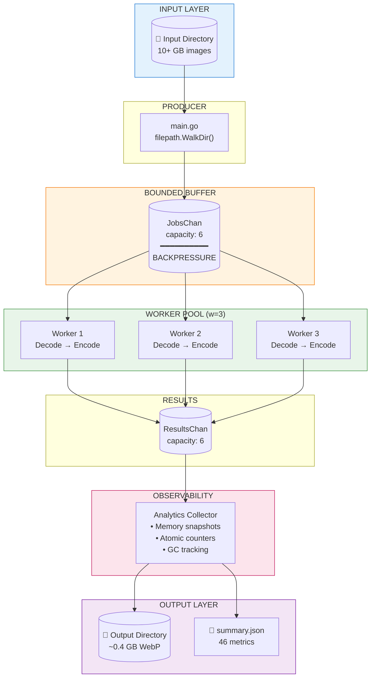
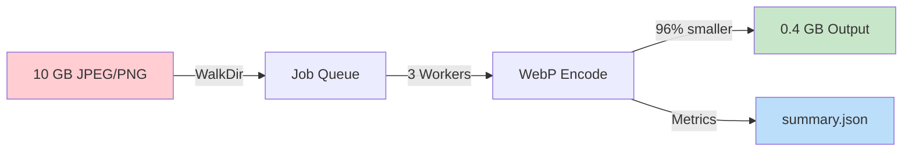
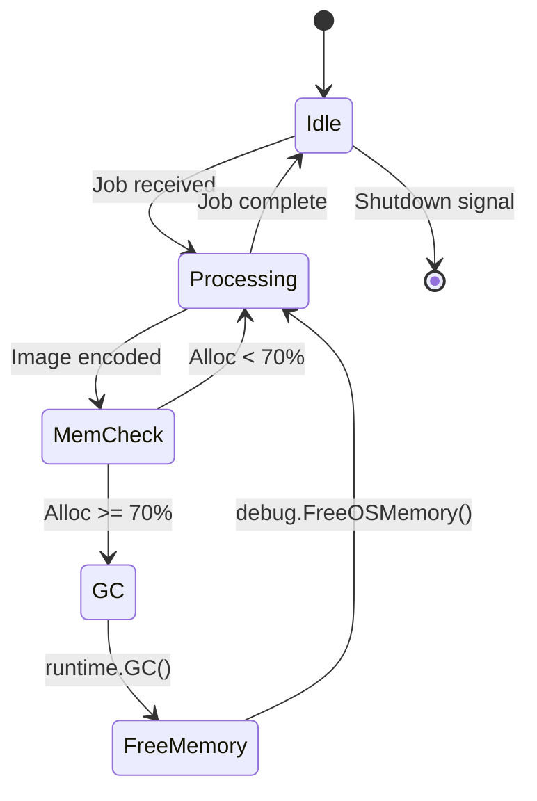

# Architecture Diagram

GitHub renders this Mermaid diagram automatically.

```mermaid
flowchart TB
    subgraph Input["INPUT LAYER"]
        A[("📁 Input Directory<br/>10+ GB images")]
    end

    subgraph Producer["PRODUCER"]
        B["main.go<br/>filepath.WalkDir()"]
    end

    subgraph Buffer["BOUNDED BUFFER"]
        C[("JobsChan<br/>capacity: 6<br/>━━━━━━━━━━<br/>BACKPRESSURE")]
    end

    subgraph Workers["WORKER POOL (w=3)"]
        D1["Worker 1<br/>Decode → Encode"]
        D2["Worker 2<br/>Decode → Encode"]
        D3["Worker 3<br/>Decode → Encode"]
    end

    subgraph Results["RESULTS"]
        E[("ResultsChan<br/>capacity: 6")]
    end

    subgraph Analytics["OBSERVABILITY"]
        F["Analytics Collector<br/>• Memory snapshots<br/>• Atomic counters<br/>• GC tracking"]
    end

    subgraph Output["OUTPUT LAYER"]
        G[("📁 Output Directory<br/>~0.4 GB WebP")]
        H["📄 summary.json<br/>46 metrics"]
    end

    A --> B
    B --> C
    C --> D1 & D2 & D3
    D1 & D2 & D3 --> E
    E --> F
    F --> G & H

    style Input fill:#e3f2fd,stroke:#1976d2
    style Buffer fill:#fff3e0,stroke:#f57c00
    style Workers fill:#e8f5e9,stroke:#388e3c
    style Analytics fill:#fce4ec,stroke:#c2185b
    style Output fill:#f3e5f5,stroke:#7b1fa2
```

## Simplified Flow

```mermaid
graph LR
    A[10 GB JPEG/PNG] -->|WalkDir| B[Job Queue]
    B -->|3 Workers| C[WebP Encode]
    C -->|96% smaller| D[0.4 GB Output]
    C -->|Metrics| E[summary.json]

    style A fill:#ffcdd2
    style D fill:#c8e6c9
    style E fill:#bbdefb
```

## Memory Management

```mermaid
stateDiagram-v2
    [*] --> Idle
    Idle --> Processing: Job received
    Processing --> MemCheck: Image encoded
    MemCheck --> Processing: Alloc < 70%
    MemCheck --> GC: Alloc >= 70%
    GC --> FreeMemory: runtime.GC()
    FreeMemory --> Processing: debug.FreeOSMemory()
    Processing --> Idle: Job complete
    Idle --> [*]: Shutdown signal
```
